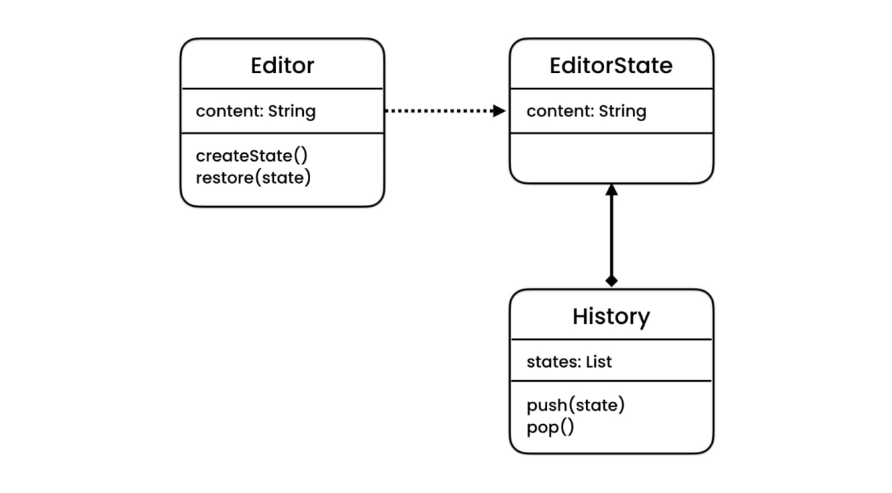
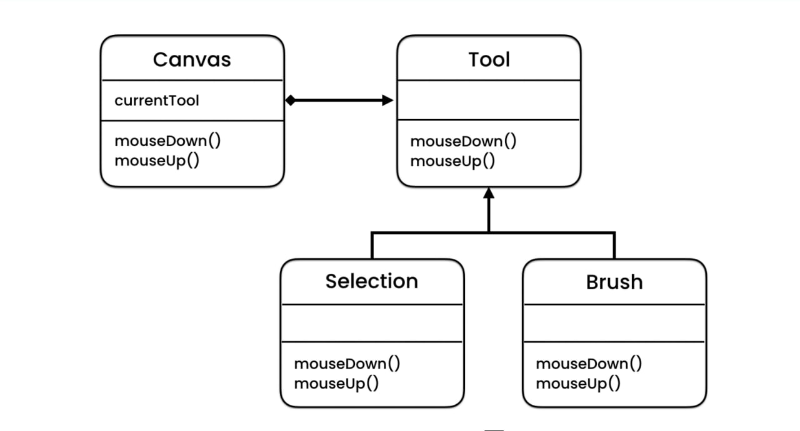
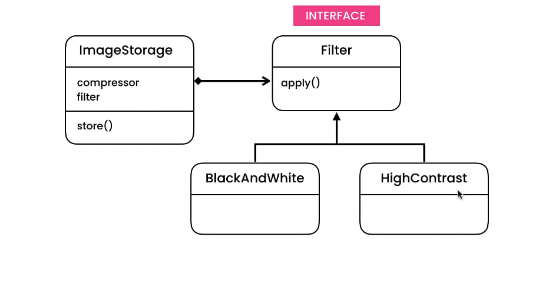

# Java Design Patterns Repository

Welcome to my Java Design Patterns repository! This repository contains a collection of commonly used design patterns implemented in Java. Design patterns are reusable solutions to common problems encountered in software design and development.

## Usage

Each design pattern is implemented in its own Java package within the respective category directory. To use a design pattern, import the corresponding package into your project and instantiate the appropriate objects as demonstrated in the main class within the package. Follow the comments or examples provided within the main class for guidance on how to use the design pattern.

## Categories

### Behavioral Design Patterns
- Chain of Responsibility
- Command
- Interpreter
- Iterator

- Mediator
- Memento

- Observer
- State

- Strategy

- Template Method
- Visitor

### Creational Design Patterns
- Singleton
- Factory Method
- Abstract Factory
- Builder
- Prototype

### Structural Design Patterns
- Adapter
- Bridge
- Composite
- Decorator
- Facade
- Flyweight
- Proxy

## Contributing

Contributions to this repository are welcome! If you have implemented additional design patterns or have improvements to existing ones, feel free to submit a pull request.

